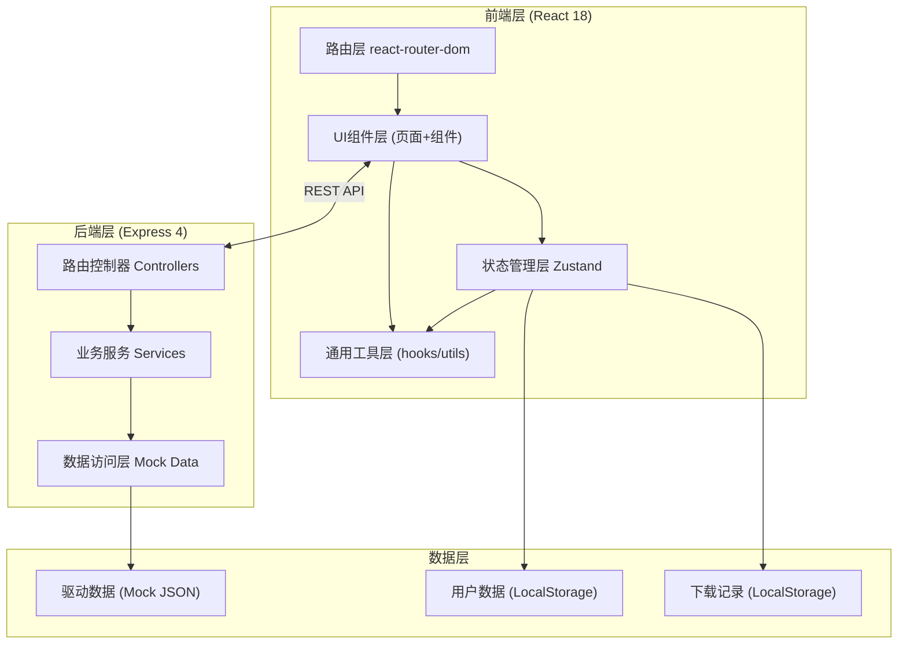
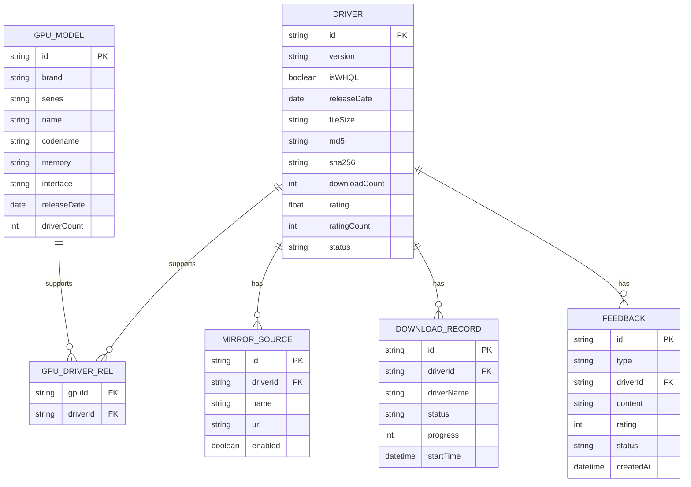

## 1. 架构设计



## 2. 技术描述
- **前端**: React@18 + TypeScript + Vite@5 + tailwindcss@3 + react-router-dom@6 + zustand@4 + lucide-react@latest
- **后端**: Express@4 + TypeScript
- **数据**: Mock数据(JSON) + LocalStorage浏览器存储
- **初始化工具**: vite-init (react-express-ts 模板)

## 3. 路由定义

| 路由 | 页面 | 用途 |
|------|------|------|
| `/` | Home | 首页搜索、品牌入口、热门推荐 |
| `/gpus` | GpuLibrary | 显卡型号库，多维筛选 |
| `/driver/:id` | DriverDetail | 驱动详情页 |
| `/compare` | VersionCompare | 版本对比页 |
| `/downloads` | DownloadHistory | 下载记录页 |
| `/compatibility` | CompatibilityGuide | 兼容性指南 |
| `/feedback` | Feedback | 问题反馈页 |
| `/admin` | AdminReview | 管理员审核页 |

## 4. API 定义

```typescript
// 显卡型号
interface GpuModel {
  id: string;
  brand: 'nvidia' | 'amd' | 'intel';
  series: string;
  name: string;
  codename?: string;
  memory?: string;
  interface?: string;
  releaseDate: string;
  driverCount: number;
  image?: string;
}

// 驱动
interface Driver {
  id: string;
  gpuIds: string[];
  version: string;
  isWHQL: boolean;
  releaseDate: string;
  fileSize: string;
  osSupport: string[];
  md5: string;
  sha256: string;
  changelog: string[];
  mirrors: MirrorSource[];
  downloadCount: number;
  rating: number;
  ratingCount: number;
  status: 'approved' | 'pending' | 'rejected';
}

interface MirrorSource {
  id: string;
  name: string;
  url: string;
  enabled: boolean;
  speed?: number;
}

// 下载记录
interface DownloadRecord {
  id: string;
  driverId: string;
  driverName: string;
  version: string;
  mirrorId: string;
  status: 'completed' | 'downloading' | 'failed' | 'canceled';
  progress: number;
  size: string;
  startTime: string;
  completedTime?: string;
}

// 用户反馈
interface Feedback {
  id: string;
  type: 'broken_link' | 'install_issue' | 'performance' | 'compatibility' | 'other';
  driverId?: string;
  mirrorId?: string;
  content: string;
  rating?: number;
  contact?: string;
  status: 'pending' | 'processing' | 'resolved';
  createdAt: string;
}
```

### API 接口列表
| Method | Path | 描述 |
|--------|------|------|
| GET | `/api/gpus` | 获取显卡列表，支持筛选参数 |
| GET | `/api/gpus/:id` | 获取单个显卡详情 |
| GET | `/api/drivers` | 获取驱动列表 |
| GET | `/api/drivers/:id` | 获取驱动详情 |
| GET | `/api/drivers/gpu/:gpuId` | 根据显卡ID获取对应驱动 |
| POST | `/api/drivers` | 提交新增驱动(待审核) |
| POST | `/api/drivers/:id/rate` | 提交驱动评分 |
| GET | `/api/downloads` | 获取下载记录 |
| POST | `/api/downloads` | 新增下载记录 |
| PATCH | `/api/downloads/:id` | 更新下载状态/进度 |
| GET | `/api/feedback` | 获取反馈列表(管理员) |
| POST | `/api/feedback` | 提交反馈 |
| PATCH | `/api/feedback/:id` | 处理反馈(管理员) |
| GET | `/api/admin/pending-drivers` | 获取待审核驱动 |
| POST | `/api/admin/drivers/:id/approve` | 审核通过 |
| POST | `/api/admin/drivers/:id/reject` | 审核驳回 |
| GET | `/api/favorites` | 获取收藏列表 |
| POST | `/api/favorites/:driverId` | 收藏驱动 |
| DELETE | `/api/favorites/:driverId` | 取消收藏 |

## 5. 数据模型



## 6. 项目目录结构

```
├── src/                           # 前端代码
│   ├── components/                # 通用组件
│   │   ├── Layout.tsx             # 布局组件(导航+页脚)
│   │   ├── GpuCard.tsx            # 显卡卡片
│   │   ├── DriverCard.tsx         # 驱动卡片
│   │   ├── SearchBar.tsx          # 搜索框
│   │   ├── FilterPanel.tsx        # 筛选面板
│   │   ├── StarRating.tsx         # 评分组件
│   │   ├── MirrorSelector.tsx     # 镜像源选择器
│   │   ├── DownloadButton.tsx     # 下载按钮(带进度)
│   │   ├── Badge.tsx              # 标签组件(WHQL等)
│   │   └── DataTable.tsx          # 通用数据表格
│   ├── pages/                     # 页面
│   │   ├── Home.tsx
│   │   ├── GpuLibrary.tsx
│   │   ├── DriverDetail.tsx
│   │   ├── VersionCompare.tsx
│   │   ├── DownloadHistory.tsx
│   │   ├── CompatibilityGuide.tsx
│   │   ├── Feedback.tsx
│   │   └── AdminReview.tsx
│   ├── hooks/                     # 自定义Hooks
│   │   ├── useDrivers.ts
│   │   ├── useGpus.ts
│   │   ├── useDownloads.ts
│   │   └── useFavorites.ts
│   ├── store/                     # Zustand状态
│   │   ├── driverStore.ts
│   │   ├── userStore.ts
│   │   └── downloadStore.ts
│   ├── utils/                     # 工具函数
│   │   ├── format.ts
│   │   ├── api.ts
│   │   └── constants.ts
│   ├── types/                     # TypeScript类型
│   │   └── index.ts
│   ├── App.tsx
│   ├── main.tsx
│   └── index.css
├── api/                           # 后端代码
│   ├── routes/
│   │   ├── gpus.ts
│   │   ├── drivers.ts
│   │   ├── downloads.ts
│   │   ├── feedback.ts
│   │   ├── admin.ts
│   │   └── favorites.ts
│   ├── data/                      # Mock数据
│   │   ├── gpus.json
│   │   ├── drivers.json
│   │   └── compatibility.json
│   ├── services/
│   └── index.ts
├── shared/                        # 共享类型
│   └── types.ts
├── package.json
├── vite.config.ts
├── tailwind.config.js
└── tsconfig.json
```
